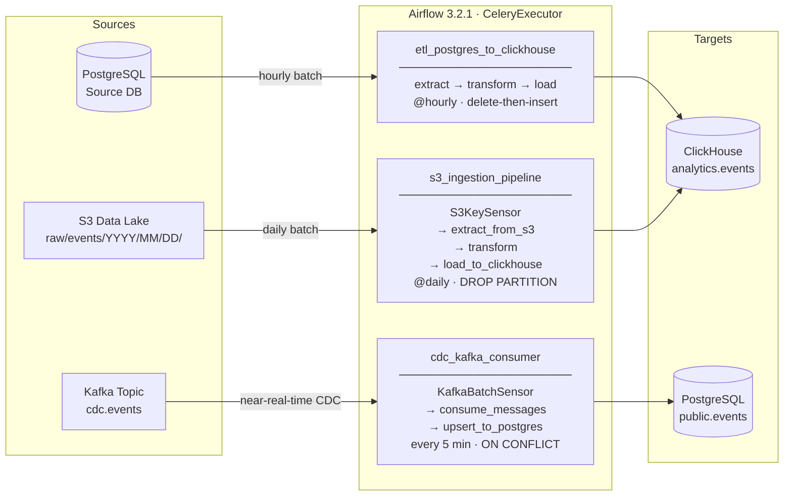

# airflow-dag-templates

Production-grade Apache Airflow 3.x DAG templates demonstrating Senior Data Platform Engineering patterns: idempotent pipelines, custom hooks, CDC streaming, S3 ingestion, and a full pytest suite.

---

## Architecture



---

## Features

| Pattern | Where |
|---|---|
| `make_dag()` factory — retry x3, exponential backoff, Slack alerting | `dags/_base_dag.py` |
| Idempotent delete-then-insert (batch ETL) | `dags/etl_postgres_to_clickhouse.py` |
| Custom `KafkaBatchSensor` (no offset commit on poke) | `dags/cdc_kafka_consumer.py` |
| At-least-once CDC with idempotent `ON CONFLICT DO UPDATE` | `dags/cdc_kafka_consumer.py` |
| S3 `_SUCCESS` marker pattern + CSV/NDJSON parsing | `dags/s3_ingestion_pipeline.py` |
| Idempotent ClickHouse load via `DROP PARTITION` + bulk insert | `dags/s3_ingestion_pipeline.py` |
| Last-write-wins deduplication on `updated_at` | `dags/s3_ingestion_pipeline.py` |
| Custom ClickHouse Hook — `get_conn`, `execute`, `get_records`, `bulk_insert` | `plugins/hooks/clickhouse_hook.py` |
| Full pytest suite — 100+ unit tests, zero real external connections | `tests/` |

---

## Prerequisites

| Tool | Version |
|---|---|
| Docker & Docker Compose v2+ | any recent |
| Python | 3.12+ (local dev only) |
| `make` | optional |

---

## Quickstart

```bash
# 1. Copy the example env file and set your local UID
cp .env.example .env
echo "AIRFLOW_UID=$(id -u)" >> .env

# 2. Initialise the metadata DB and create the admin user (runs once)
docker compose up airflow-init

# 3. Start all services in detached mode
docker compose up -d

# 4. Open the Airflow UI
open http://localhost:8080   # credentials: admin / admin
```

### Optional: Celery Flower monitoring

```bash
docker compose --profile flower up -d
open http://localhost:5555
```

### Stop / reset

```bash
docker compose down                       # stop containers, keep volumes
docker compose down -v --remove-orphans   # full reset
```

---

## Running tests

> **Platform note** — Airflow 3.x depends on `fcntl` and other POSIX-only system
> calls deep in its import chain (`DagBundlesManager`, `BaseDagBundle`, etc.).
> These modules do not exist on Windows, so the full test suite **must run on
> Linux or macOS** — either inside Docker or in a native Linux/macOS virtualenv.
> Running `pytest` directly on Windows will fail with
> `ModuleNotFoundError: No module named 'fcntl'` for any test that imports
> `DagBag` or other Airflow internals.

### Inside Docker (the only supported way)

```bash
docker compose exec airflow-worker bash -c "
  pip install pytest pytest-mock --quiet &&
  pytest tests/ -v
"
```

### Linux / macOS virtualenv

```bash
python3 -m venv .venv
source .venv/bin/activate
pip install -r requirements.txt
pytest tests/ -v
```

### Run a single test module

```bash
pytest tests/dags/test_base_dag.py -v
pytest tests/dags/test_s3_ingestion_pipeline.py -v
pytest tests/plugins/hooks/test_clickhouse_hook.py -v
```

---

## How to add a new DAG

1. **Create** `dags/my_new_dag.py` using the factory:

```python
from __future__ import annotations
from datetime import datetime
from typing import Any
from airflow.sdk import task
from _base_dag import make_dag, build_idempotent_run_key

with make_dag(
    dag_id="my_new_dag",
    description="Short description shown in the Airflow UI",
    schedule="@daily",
    start_date=datetime(2024, 1, 1),
    tags=["my-team", "source-system"],
    source="source_db.my_table",
    destination="target_db.my_table",
) as dag:

    @task
    def extract(logical_date: datetime = None, **context: Any) -> list[dict]:
        run_key = build_idempotent_run_key("my_new_dag", logical_date)
        ...

    @task
    def load(rows: list[dict], logical_date: datetime = None, **context: Any) -> None:
        ...

    load(extract())
```

2. **Add tests** in `tests/dags/test_my_new_dag.py` mirroring the same structure as the existing test files.

3. **Register connections** in the Airflow UI (Admin → Connections) or via environment variables in `.env`.

---

## Airflow Variables

Configure in the UI (Admin → Variables) or via the CLI:

```bash
docker compose exec airflow-webserver \
  airflow variables set alert_slack_enabled true
```

| Variable | Required | Default | Description |
|---|---|---|---|
| `alert_slack_enabled` | No | `false` | Enable Slack failure alerts |
| `alert_slack_webhook` | Only if Slack enabled | — | Slack Incoming Webhook URL |
| `kafka_bootstrap_servers` | CDC DAG | — | Comma-separated broker list, e.g. `broker:9092` |
| `s3_bucket` | S3 DAG | — | S3 bucket name, e.g. `my-data-lake` |
| `s3_prefix` | S3 DAG | — | Key prefix inside the bucket, e.g. `raw/events` |

---

## Airflow Connections

Configure in the UI (Admin → Connections):

| Conn ID | Type | Used by |
|---|---|---|
| `postgres_source` | Postgres | `etl_postgres_to_clickhouse` |
| `clickhouse_analytics` | Generic / ClickHouse | `etl_postgres_to_clickhouse`, `s3_ingestion_pipeline` |
| `postgres_target` | Postgres | `cdc_kafka_consumer` |
| `aws_default` | Amazon Web Services | `s3_ingestion_pipeline` |

---

## Project structure

```
airflow-dag-templates/
│
├── dags/
│   ├── _base_dag.py                        # make_dag() factory, retry policy, Slack callback,
│   │                                       # build_idempotent_run_key(), build_dag_doc()
│   ├── etl_postgres_to_clickhouse.py       # Hourly batch ETL: extract → transform → load
│   ├── cdc_kafka_consumer.py               # Near-real-time CDC: KafkaBatchSensor → consume → upsert
│   └── s3_ingestion_pipeline.py            # Daily S3 ingestion: S3Sensor → extract → transform → load
│
├── plugins/
│   └── hooks/
│       └── clickhouse_hook.py              # Custom ClickHouse Hook (clickhouse-driver)
│
├── tests/
│   ├── conftest.py                         # Shared fixtures, Airflow unit-test env setup
│   ├── dags/
│   │   ├── test_base_dag.py                # 35+ unit tests for _base_dag.py
│   │   ├── test_etl_postgres_to_clickhouse.py
│   │   └── test_s3_ingestion_pipeline.py   # DAG structure + parse/transform/load tests
│   └── plugins/
│       └── hooks/
│           └── test_clickhouse_hook.py     # 20+ unit tests for ClickHouseHook
│
├── docker-compose.yml                      # Airflow 3.2.1 + Postgres 17 + Redis 7, CeleryExecutor
├── requirements.txt                        # All Python dependencies
├── .env.example                            # Environment variable template
├── pytest.ini                              # pytest configuration
└── .gitignore
```

---

## Design decisions

**Idempotency strategies** — each DAG uses the right tool for its access pattern:
- Batch ETL → delete-then-insert (window-based, fixed time range)
- CDC → `ON CONFLICT DO UPDATE` (row-level, keyed on primary key)
- S3 ingestion → `DROP PARTITION` + bulk insert (partition-level, cheapest operation in ClickHouse MergeTree)

**At-least-once CDC** — the `KafkaBatchSensor` never commits offsets. `consume_messages` reads without committing. Only `upsert_to_postgres` commits after a successful write, so a crash anywhere retries the full consume+write cycle.

**S3 `_SUCCESS` marker** — the sensor waits for a marker file written by the upstream Spark/Glue job rather than polling for data files directly. This prevents partial reads when the upstream job is still writing.

**Last-write-wins deduplication** — the S3 pipeline deduplicates on primary key before loading, keeping the row with the largest `updated_at`. This handles re-delivered or out-of-order records from upstream systems.

**Alerting as configuration** — Slack alerts are toggled via `alert_slack_enabled` Airflow Variable, not by changing DAG code. The callback reads the variable at runtime, so enabling/disabling alerts requires no deployment.

**ClickHouse hook lazy import** — `clickhouse-driver` is imported inside `get_conn()`, not at module level. Workers that do not have the driver installed can still parse DAG files without errors; only tasks that call the hook need the dependency.

---

## Tech stack

- **Orchestration**: Apache Airflow 3.2.1
- **Executor**: CeleryExecutor (Redis broker)
- **Metadata DB**: PostgreSQL 17
- **OLAP**: ClickHouse (via `clickhouse-driver`)
- **Streaming**: Apache Kafka (via `kafka-python`)
- **Object storage**: Amazon S3 (via `apache-airflow-providers-amazon`)
- **Testing**: pytest, unittest.mock
- **Containerisation**: Docker Compose
